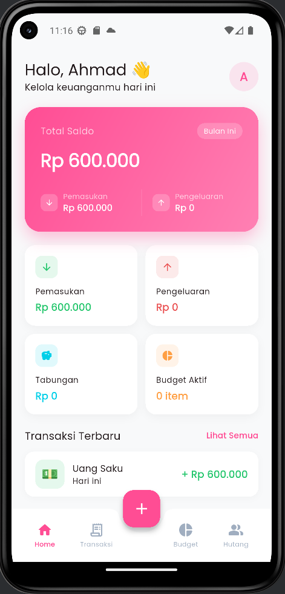
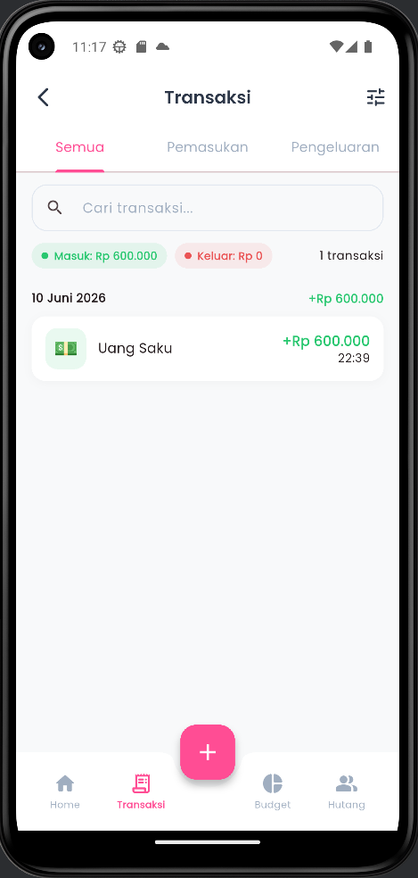
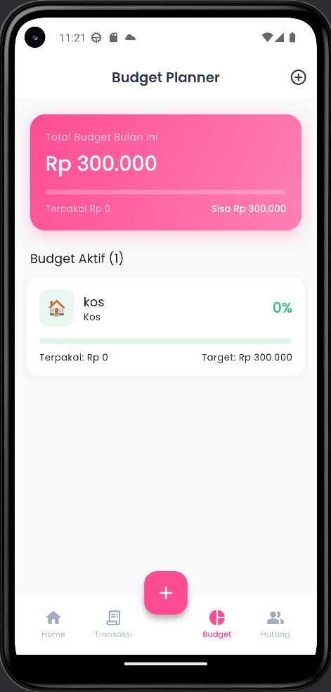
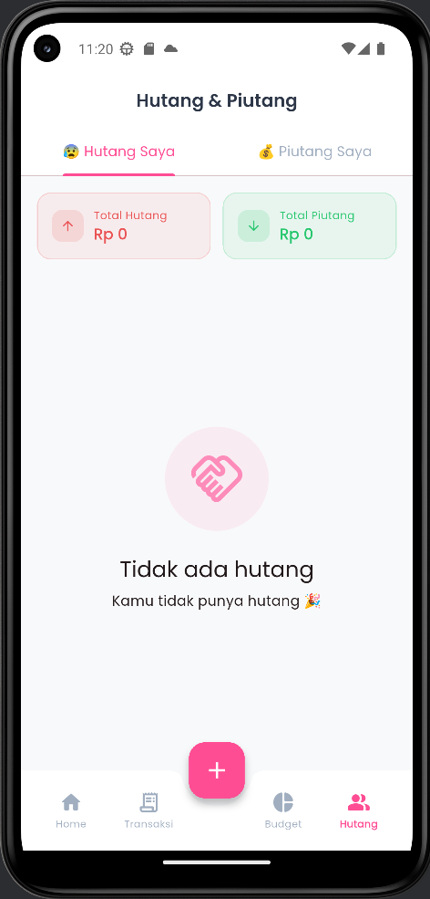

# 💸 FinTrack — Aplikasi Keuangan Mahasiswa

<p align="center">
  
  
  
  
  
</p>

> Kelola pemasukan, pengeluaran, budget, tabungan, dan hutang — semuanya dalam satu aplikasi Flutter **offline-first** yang elegan.

---

## 📋 Daftar Isi

- [Fitur](#-fitur)
- [Tangkapan Layar](#-tangkapan-layar)
- [Instalasi](#-instalasi)
- [Struktur Proyek](#-struktur-proyek)
- [Arsitektur](#-arsitektur)
- [Dependensi](#-dependensi-utama)
- [Database](#-skema-database)
- [Roadmap](#-roadmap)
- [Kontribusi](#-kontribusi)
- [Lisensi](#-lisensi)

---

## ✨ Fitur

### 💰 Manajemen Transaksi
- Catat pemasukan & pengeluaran dengan kategori lengkap
- Foto bukti transaksi (struk, nota)
- Filter & pencarian canggih (kategori, tanggal, kata kunci)
- Swipe-to-delete dengan konfirmasi
- Grouping transaksi per tanggal

### 📊 Budget Planner
- Buat budget per kategori (harian / mingguan / bulanan)
- Progress bar visual dengan peringatan otomatis (< 20% sisa)
- Sinkronisasi otomatis dengan transaksi terkait

### 🏦 Target Tabungan
- Buat multiple target tabungan dengan deadline
- Circular progress indicator
- Notifikasi milestone (25%, 50%, 75%, 100%)
- Kalkulasi otomatis nominal yang perlu ditabung per hari

### 🤝 Hutang & Piutang
- Pisahkan hutang (owed) dan piutang (receivable)
- Tandai lunas dengan satu tap
- Peringatan jatuh tempo otomatis
- Highlight merah untuk yang sudah overdue

### 📈 Rekap & Laporan
- Laporan harian, mingguan, bulanan, tahunan
- Pie chart pengeluaran per kategori
- Bar chart tren bulanan income vs expense
- Export ke **PDF** (laporan lengkap)
- Export ke **CSV** (data transaksi)

### ⚙️ Pengaturan & Profil
- Mode gelap / terang
- Atur uang saku bulanan → kalkulasi budget harian & mingguan otomatis
- Multi-bahasa (Indonesia & English)
- Edit profil & ganti password

---

## 📱 Tangkapan Layar

> Tambahkan screenshot di folder `screenshots/` lalu update tabel ini.

| Dashboard | Transaksi | Budget | Tabungan |
|-----------|-----------|--------|----------|
|  |  |  |  |

---

## 🚀 Instalasi

### Prasyarat

| Tools | Versi Minimal |
|-------|---------------|
| Flutter SDK | 3.3.0 |
| Dart SDK | 3.3.0 |
| Android SDK | API 21+ (Android 5.0) |
| iOS | 12.0+ |

### Clone & Setup

```bash
# 1. Clone repository
git clone https://github.com/username/fintrack.git
cd fintrack

# 2. Install dependencies
flutter pub get

# 3. Buat folder assets
mkdir -p assets/images assets/icons

# 4. Jalankan aplikasi
flutter run
```

### Build Release

```bash
# Android APK
flutter build apk --release

# Android App Bundle (Play Store)
flutter build appbundle --release

# iOS
flutter build ios --release
```

---

## 🗂️ Struktur Proyek

```
lib/
├── core/
│   ├── constants/
│   │   ├── app_colors.dart         # Palet warna & gradien
│   │   └── app_constants.dart      # Konstanta global (DB, kategori, dll)
│   ├── services/
│   │   ├── auth_service.dart
│   │   ├── notification_service.dart
│   │   ├── pdf_export_service.dart
│   │   └── csv_export_service.dart
│   ├── theme/
│   │   └── app_theme.dart          # Light & dark theme (Material 3)
│   ├── utils/
│   │   ├── currency_formatter.dart
│   │   └── validators.dart
│   └── widgets/
│       └── common_widgets.dart     # GradientCard, EmptyState, dll
│
├── data/
│   ├── database/
│   │   └── database_helper.dart    # SQLite singleton & schema
│   ├── models/
│   │   ├── user_model.dart
│   │   ├── transaction_model.dart
│   │   ├── budget_model.dart
│   │   ├── debt_model.dart
│   │   ├── savings_model.dart
│   │   └── account_model.dart
│   └── repositories/
│       ├── user_repository.dart
│       ├── transaction_repository.dart
│       ├── budget_repository.dart
│       ├── debt_repository.dart
│       └── savings_repository.dart
│
├── features/
│   ├── auth/          # Login, Register
│   ├── dashboard/     # Dashboard, MainShell
│   ├── transaction/   # Transaksi, Add, Detail
│   ├── budget/        # Budget, Add Budget
│   ├── debt/          # Hutang & Piutang
│   ├── savings/       # Tabungan, Detail
│   ├── reports/       # Laporan & Export
│   └── settings/      # Pengaturan, Profil
│
└── routes/
    └── app_router.dart             # Named routing terpusat
```

---

## 🏛️ Arsitektur

FinTrack menggunakan arsitektur **Feature-First** dengan **Repository Pattern**.

```
UI Layer (Pages / Widgets)
        ↓
State Layer (Riverpod StateNotifier)
        ↓
Repository Layer
        ↓
Database Layer (SQLite via sqflite)
```

**State Management:** `flutter_riverpod` — `StateNotifierProvider` untuk state mutable, `Provider` untuk DI, `FutureProvider.family` untuk query async berparameter.

**Keamanan:** Password di-hash dengan **SHA-256** sebelum disimpan ke database.

---

## 📦 Dependensi Utama

| Package | Kegunaan | Versi |
|---------|----------|-------|
| `flutter_riverpod` | State management | ^2.5.1 |
| `sqflite` | Local database SQLite | ^2.3.3 |
| `shared_preferences` | Penyimpanan preferensi | ^2.3.2 |
| `fl_chart` | Grafik pie & bar | ^0.69.0 |
| `pdf` | Generate laporan PDF | ^3.11.1 |
| `google_fonts` | Tipografi Poppins | ^6.2.1 |
| `flutter_local_notifications` | Push notifikasi lokal | ^18.0.1 |
| `image_picker` | Foto bukti transaksi | ^1.1.2 |
| `percent_indicator` | Progress bar & circular | ^4.2.3 |
| `crypto` | Hash password SHA-256 | ^3.0.5 |
| `intl` | Format currency & tanggal | ^0.19.0 |
| `uuid` | Generate unique ID | ^4.5.1 |

---

## 🗃️ Skema Database

```sql
users        (id, name, email, password, avatar, monthly_allowance, ...)
transactions (id, user_id, type, amount, category, note, image_path, date, ...)
budgets      (id, user_id, name, category, target, used, period, start_date, end_date, ...)
debts        (id, user_id, type, person_name, amount, paid_amount, status, due_date, ...)
savings      (id, user_id, goal_name, target_amount, current_amount, deadline, icon, ...)
accounts     (id, user_id, name, type, balance, is_default, ...)
```

---

## 🎨 Design System

| Token | Nilai |
|-------|-------|
| Primary | `#FF4D94` (Pink) |
| Success | `#28C76F` (Green) |
| Danger | `#EA5455` (Red) |
| Warning | `#FF9F43` (Orange) |
| Info | `#00CFE8` (Cyan) |
| Font | Poppins (Google Fonts) |
| Theme | Material 3, Light & Dark |

---

## 🛣️ Roadmap

- [ ] Sinkronisasi cloud (Firebase / Supabase)
- [ ] Multi-akun (Tunai, BCA, GoPay, dll)
- [ ] Widget home screen Android
- [ ] Recurring transaction otomatis
- [ ] Biometric lock (fingerprint / Face ID)
- [ ] Import transaksi dari CSV/Excel
- [ ] Analisis pengeluaran berbasis AI

---

## 🤝 Kontribusi

Kontribusi sangat disambut! Silakan baca [CONTRIBUTING.md](CONTRIBUTING.md) untuk panduan lengkap.

```bash
# 1. Fork repository
# 2. Buat branch fitur
git checkout -b feat/nama-fitur

# 3. Commit dengan konvensi
git commit -m "feat: deskripsi singkat"

# 4. Push & buat Pull Request
git push origin feat/nama-fitur
```

---

## 📄 Lisensi

Proyek ini dilisensikan di bawah **MIT License** — lihat file [LICENSE](LICENSE) untuk detail.

---

<p align="center">Dibuat dengan ❤️ untuk mahasiswa Indonesia &nbsp;•&nbsp; ⭐ Star jika bermanfaat!</p>
